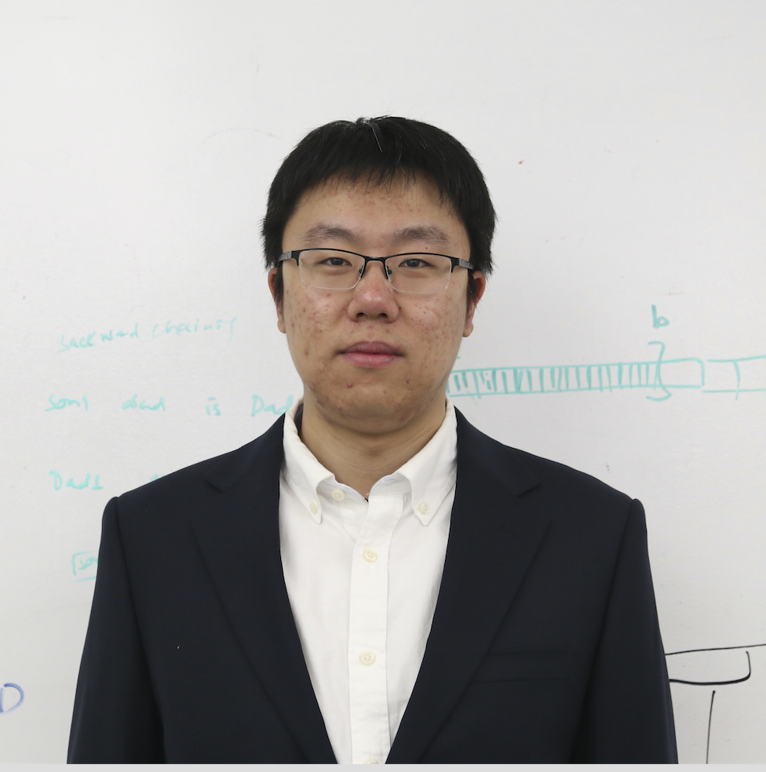

# Yuede Ji
Pronounciation: yüehte chi 


## About me
I am a Ph.D. student from the Department of Electrical and Computer Engineering at The George Washington University. It's my great honor to be advised by [Prof. H. Howie Huang](https://www.seas.gwu.edu/howie-huang). Prior to joining GWU, I received my B.E., M.S. from Jilin University, advised by [Prof. Qiang Li](http://ccst.jlu.edu.cn/info/1026/6668.htm).

My research interests are in the areas of security and big data analytics with multi-disciplinary ties to machine learning and high-performance computing.
The goal of my research is to enable the design and implementation of scalable and effective system solutions to protect emerging data and computing devices. My Ph.D. work focuses on (1) detecting vulnerabilities of the software and systems inside IoT devices and mobile devices; (2) combating evolving cyber threats in terms of the botnet and advanced persistent threat with graph-based machine learning techniques; (3) building high-performance data analytics systems with a special focus on graph data using shared-memory systems, distributed systems, and GPUs. My work intersects cybersecurity, data analytics, machine learning, and high-performance computing.

## News

*June 2020*: Start working as a senior intern at Kryptowire Led by Prof. Angelos Stavrou from Virginia Tech.

*May 2020*: Our paper on lateral movement detection, CyberGraph, is accepted by RAID'20.

*March 2020*: Our paper on graph connectivity computation framework, Aquila, is accepted by HPDC'20.

## Publications ([Google Scholar](https://scholar.google.com/citations?user=1-GjVYgAAAAJ&hl=en&oi=ao), [dblp](http://dblp.uni-trier.de/pers/hd/j/Ji:Yuede))
### Conference Paper

* Aquila: Adaptive Parallel Computation of Graph Connectivity Queries. [[PDF]](static/papers/Aquila_HPDC20_final.pdf)[[PPT]](static/papers/Aquila_HPDC_20_slides.pdf)[[Video]](https://youtu.be/CtkJtICiHRc)[[Code]](https://github.com/iHeartGraph/Aquila) <u>Yuede Ji</u> and H. Howie Huang <strong>[HPDC'20]</strong>, The 29th International Symposium on High-Performance Parallel and Distributed Computing 

* Detecting Lateral Movement in Enterprise Computer Networks with Unsupervised Graph AI. [[PDF]](static/papers/20_lateral_movement_RAID.pdf) 
Benjamin Bowman, Craig Laprade, <u>Yuede Ji</u>, and H. Howie Huang <strong>[RAID'20]</strong>, The 23rd International Symposium on Research in Attacks, Intrusions and Defenses 

* Securing Malware Cognitive Systems against Adversarial Attacks. [[PDF]](static/papers/DeepArmour_ICCC19.pdf)[[PPT]](static/papers/DeepArmour_ICCC_19_slides.pdf)  <u>Yuede Ji</u>, Benjamin Bowman, and H. Howie Huang, <strong>[ICCC'19]</strong>, 2019 IEEE International Conference on Cognitive Computing, 
Invited to the panel discussion at The AAAI-19 Workshop on Artificial Intelligence for Cyber Security 

* iSpan: Parallel Identification of Strongly Connected Components with Spanning Trees. [[PDF]](static/papers/iSpan_SC18.pdf)[[PPT]](static/papers/iSpan_SC_18.pdf)[[Code]](https://github.com/iHeartGraph/iSpan) <u>Yuede Ji</u>, Hang Liu, and H. Howie Huang, <strong>[SC'18]</strong>, Proceedings of the International Conference for High Performance Computing, Networking, Storage, and Analysis 

* Detection of Forwarding-based Malicious URLs in Online Social Networks. [[PDF]](static/papers/7 Detection of Forwarding-Based Malicious URLs in Online Social Networks_IJPP2014.pdf) Jian Cao, Qiang Li, <u>Yuede Ji</u>, Yukun He, and Dong Guo. <strong>[NPC'14]</strong>, IFIP International Conference on Network and Parallel Computing, <strong> Best Paper Award</strong> Invited to journal publication, International Journal of Parallel Programming, 44(1), 163-180, 2016.

* Towards Social Botnet Behavior Detecting in the End Host. [[PDF]](static/papers/8 Towards Social Botnet Behavior Detecting in the End Host_ICPADS2014.pdf) [[PPT]](static/papers/8_Social_Botnet_ICPADS_2014_slides.pdf) [[DATA]](https://yuede.github.io/open_source.html) <u>Yuede Ji</u>, Yukun He, Xinyang Jiang, and Qiang Li. <strong>[ICPADS'14]</strong>, 20th IEEE International Conference on Parallel and Distributed System, 2014

* A Multiprocess Mechanism of Evading Behavior-Based Bot Detection Approaches. [[PDF]](static/papers/5 A Mulitiprocess Mechanism of Evading Behavior-Based Bot Detection Approaches_ISPEC_2014.pdf) [[PPT]](static/papers/5_multiproces_ispec14.pptx)  <u>Yuede Ji</u>, Yukun He, Dewei Zhu, Qiang Li, and Dong Guo. <strong>[ISPEC'14]</strong>, Information Security Practice and Experience, 2014

* BotCatch: A Behavior and Signature Correlated Bot Detection Approach. [[PDF]](static/papers/4 BotCatch A Behavior and Signature Correlated Bot Detection Approach_HPCC2013.pdf) [[PPT]](static/papers/4_botcatch_report-final.pptx) <u>Yuede Ji</u>, Yukun He, Qiang Li, and Dong Guo. <strong>[HPCC'13]</strong>, IEEE International Conference on High Performance Computing and Communications & IEEE International Conference on Embedded and Ubiquitous Computing, 2013.

* BotInfer: A Bot Inference Approach by Correlating Host and Network Information.  [[PDF]](static/papers/2 BotInfer A Bot Inference Approach by Correlating Host and Network Information_NPC2013.pdf) Yukun He, Qiang Li, <u>Yuede Ji</u>, and Dong Guo. <strong>[NPC'13]</strong>, FIP International Conference on Network and Parallel Computing, 2013

### Journal Paper

* GRL: Knowledge Graph Completion with GAN-based Reinforcement Learning.  Qi Wang, <u>Yuede Ji</u>, Yongsheng Hao, and Jie Cao.   <strong>[KBS]</strong>, Knowledge-Based Systems, 2020. 

* Stopping the Cyber Attack in the Early Stage: Assessing the Security Risks of Social Network Users. [[PDF]](static/papers/Stopping_the_Cyberattack_in_the_Early_Stage_Assess.pdf) Bo Feng, Qiang Li, <u>Yuede Ji</u>, Dong Guo, and Xiangyu Meng. <strong>[SCN]</strong>, Security and Communication Networks, 2019. 

* Understanding socialbot behavior on end hosts. [[PDF]](static/papers/Understanding_socialbot_behavior_on_end_hosts.pdf) 
Yukun He, Qiang Li, Jian Cao, <u>Yuede Ji</u>, and Dong Guo, 
<strong>[IJDSN]</strong>, International Journal of Distributed Sensor Networks, 2017. 

* Combating the evasion mechanisms of social bots. [[PDF]](static/papers/Combating the evasion mechanisms of social bots_CS_2016.pdf) [[DATA]](https://yuede.github.io/open_source.html) <u>Yuede Ji</u>, Yukun He, Xinyang Jiang, Jian Cao, Qiang Li  <strong>[Computers & Security]</strong>, Volume 58, Pages 230-249, 2016. 

* BotCatch: leveraging signature and behavior for bot detection. [[PDF]](static/papers/6 BotCatch leveraging signature and behavior for bot detection_SCN_1052.pdf) <u>Yuede Ji</u>, Qiang Li, Yukun He, and Dong Guo. <strong>[SCN]</strong>, Security and Communication Networks, 8(6): 952-969, 2015.

* Overhead Analysis and Evaluation of Approaches to Host-based Bot Detection. [[PDF]](static/papers/9_Overhead Analysis and Evaluation of Approaches to Host-Based Bot Detection.pdf) <u>Yuede Ji</u>, Qiang Li, Yukun He, and Dong Guo. <strong>[IJDSN]</strong>, International Journal of Distributed Sensor Networks, 2015. 

### Invited Book Chapter

* Unstanding and Detecting Social Botnet. <u>Yuede Ji</u>, and Qiang Li <strong>[Invited book chapter]</strong>, Botnets: Architectures, Countermeasures, and Challenges, 2019. 

## Selected Awards
* **Best Paper Award**, NPC 2014, IFIP International Conference on Network and Parallel Computing 

* Student Travel Grant, SC 2018, USENIX ATC 2017

* Outstanding Master's Thesis, Jilin University, 2015 

* National Scholarship for Graduate Students, China, 2015

## Teaching Courses
* [SEAS 1001 - Engineering Orientation](https://www.seas.gwu.edu/~seas001/fall16/)

* [ECE 1010 - Introduction to Electrical and Computer Engineering](https://www.seas.gwu.edu/~ece001/)

## Working Exeprience

* 2015.9 - now, Graduate Research Assistant, George Washington University

* 2017.9 - 2018.5, Intern at the Planning and Strategic Initiatives of DIT, George Washington University

* 2016.9 - 2016.12, Graduate Teaching Assistant, George Washington University

* 2012.9 - 2015.6, Graduate Research Assistant, Jilin University

* 2011.7 - 2011.9, Software Engineer Intern, Baidu

## Professional Service

* **Program Committee**
    * IEEE Security and Privacy, 2019 (Student PC)
    * IEEE Security and Privacy, 2018 (Student PC)
    * EuroSys, 2018 (Shadow PC)

* **Journal Reviewer** 
    * IEEE Transactions on Cloud Computing
    * Computer Networks
    * Journal of Parallel and Distributed Computing
    * Security and Communication Networks
    * Frontiers of Computer Science
    * Wireless Communications and Mobile Computing
    * IEEE Access
* **Volunteer**
    * HPDC 2017



